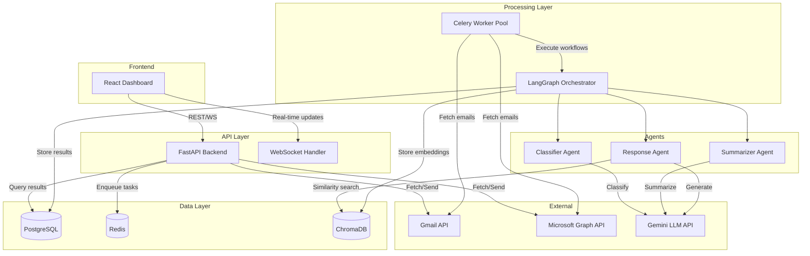
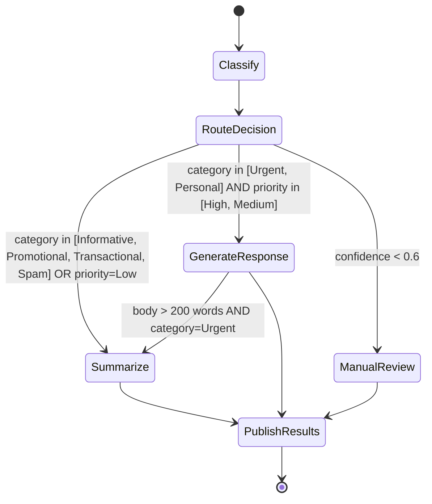
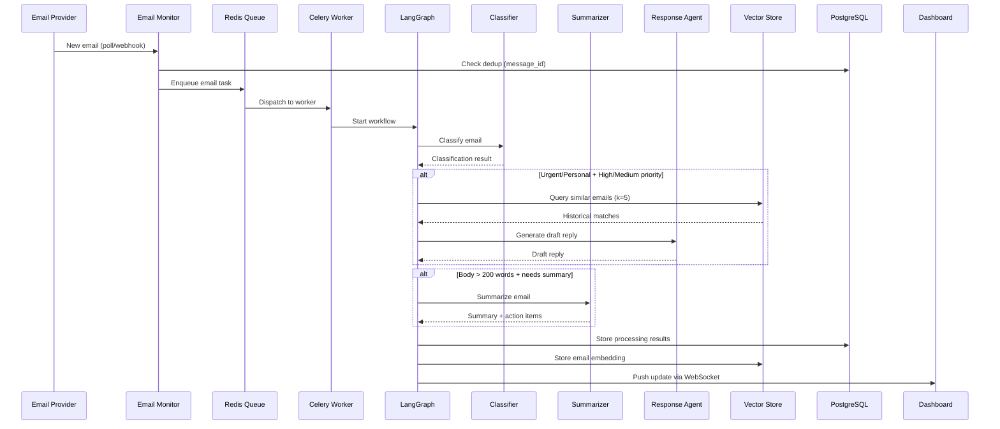

# Design Document: AI Email Agent System

## Overview

This document describes the technical design for an AI-powered multi-agent email management system. The system orchestrates a pipeline of specialized agents (Classifier, Summarizer, Response) using LangGraph's StateGraph to automatically process incoming emails — classifying them by intent/urgency, summarizing lengthy messages, and generating contextual draft replies informed by semantic search of historical emails stored in ChromaDB.

The architecture follows an event-driven, microservices-inspired pattern with:
- **FastAPI** as the HTTP/WebSocket API layer
- **LangGraph** for stateful agent orchestration with conditional routing
- **Google Gemini** for LLM inference (classification, summarization, generation) and text embeddings
- **ChromaDB** (or Pinecone) as the vector store for semantic search
- **Gmail API / Microsoft Graph API** for email provider integration
- **React** dashboard for human-in-the-loop review and approval

### Design Decisions

1. **LangGraph over plain LangChain**: LangGraph provides stateful, cyclic graph execution with built-in checkpointing, retry logic, and human-in-the-loop patterns. This maps directly to the requirement for a coordinated agent pipeline with conditional routing and failure recovery.

2. **ChromaDB as primary vector store**: ChromaDB offers zero-ops local setup for development with a path to Chroma Cloud for production. It supports metadata filtering combined with similarity search, matching Requirement 5.4. Pinecone is supported as an alternative for higher-scale deployments.

3. **Gemini for both generation and embeddings**: Using `gemini-embedding-001` (3072-dimensional vectors) for embeddings and `gemini-2.0-flash` for text generation simplifies the dependency chain. Both are accessible through the `google-generativeai` Python SDK.

4. **Celery + Redis for background processing**: Email polling and agent pipeline execution are long-running tasks that must survive server restarts and support concurrency. Celery provides task queuing, retry policies, and concurrency control that aligns with Requirement 6.5 (up to 10 concurrent workflows).

5. **PostgreSQL for structured metadata**: Processing results, workflow state, and email metadata are stored in PostgreSQL for transactional guarantees, while ChromaDB handles vector similarity search exclusively.

## Architecture

### High-Level System Architecture



### Agent Orchestration Flow (LangGraph StateGraph)



### Request Flow Sequence



## Components and Interfaces

### 1. Email Monitor Service

**Responsibility**: Periodically polls or listens for webhook notifications from email providers, fetches new emails, deduplicates, and enqueues them for processing.

```python
class EmailMonitor:
    """Manages email fetching from connected providers."""
    
    async def start_polling(self, interval_seconds: int = 60) -> None:
        """Start periodic polling loop. Min interval: 10s."""
    
    async def handle_webhook(self, payload: WebhookPayload) -> None:
        """Process incoming webhook notification within 5s."""
    
    async def fetch_emails(self, provider: EmailProvider) -> list[RawEmail]:
        """Fetch unread emails from the specified provider."""
    
    async def enqueue_email(self, email: RawEmail) -> str:
        """Deduplicate and enqueue email for processing. Returns task ID."""
    
    def is_duplicate(self, message_id: str) -> bool:
        """Check if email was already processed."""
```

### 2. Agent Orchestrator (LangGraph)

**Responsibility**: Coordinates the execution of Classifier, Summarizer, and Response agents as a stateful graph workflow with conditional routing, retries, and timeout handling.

```python
from langgraph.graph import StateGraph, END
from typing import TypedDict, Literal

class EmailWorkflowState(TypedDict):
    email: RawEmail
    classification: ClassificationResult | None
    summary: SummaryResult | None
    draft_reply: DraftReply | None
    retry_counts: dict[str, int]
    current_stage: str
    error: str | None

def build_email_workflow() -> StateGraph:
    """Construct the LangGraph workflow for email processing."""

class AgentOrchestrator:
    """Manages LangGraph workflow execution."""
    
    async def process_email(self, email: RawEmail) -> WorkflowResult:
        """Execute the full agent pipeline for an email."""
    
    def route_after_classification(self, state: EmailWorkflowState) -> str:
        """Determine next node based on classification result."""
    
    async def handle_agent_failure(self, agent: str, state: EmailWorkflowState) -> EmailWorkflowState:
        """Retry failed agent up to 3 times."""
```

### 3. Classifier Agent

**Responsibility**: Analyzes email subject and body via Gemini to produce a structured classification (category, priority, confidence).

```python
class ClassifierAgent:
    """Classifies emails using Gemini LLM."""
    
    async def classify(self, email: RawEmail) -> ClassificationResult:
        """Analyze email and return classification within 10s timeout."""
    
    def build_classification_prompt(self, email: RawEmail) -> str:
        """Construct the structured classification prompt."""
    
    def validate_result(self, raw_output: str) -> ClassificationResult:
        """Parse and validate LLM output against schema."""
```

### 4. Summarizer Agent

**Responsibility**: Produces concise summaries (max 3 sentences) and extracts action items from emails exceeding 200 words.

```python
class SummarizerAgent:
    """Summarizes emails and extracts action items using Gemini."""
    
    async def summarize(self, email: RawEmail) -> SummaryResult:
        """Generate summary within 8s timeout."""
    
    def should_summarize(self, email: RawEmail) -> bool:
        """Check if email body exceeds 200 word threshold."""
    
    def build_summary_prompt(self, email: RawEmail) -> str:
        """Construct prompt for summarization and action item extraction."""
    
    def fallback_summary(self, email: RawEmail) -> SummaryResult:
        """Return first 3 sentences as fallback when LLM fails."""
```

### 5. Response Agent

**Responsibility**: Generates contextual draft replies using semantic search of historical emails for tone matching.

```python
class ResponseAgent:
    """Generates draft replies with historical context."""
    
    async def generate_reply(self, email: RawEmail, classification: ClassificationResult) -> DraftReply:
        """Generate draft reply within 15s timeout."""
    
    async def retrieve_context(self, email: RawEmail, k: int = 5) -> list[HistoricalEmail]:
        """Query vector store for semantically similar past emails."""
    
    def build_response_prompt(
        self, email: RawEmail, history: list[HistoricalEmail]
    ) -> str:
        """Construct prompt with current email + historical tone context."""
    
    def validate_draft(self, draft: DraftReply) -> DraftReply:
        """Enforce max 500 words body, max 150 chars subject."""
```

### 6. Vector Store Service

**Responsibility**: Manages email embeddings and performs semantic similarity search using ChromaDB.

```python
class VectorStoreService:
    """Manages ChromaDB operations for email embeddings."""
    
    async def store_embedding(self, email_id: str, text: str, metadata: EmailMetadata) -> str:
        """Generate embedding and store in ChromaDB. Returns record ID."""
    
    async def search_similar(
        self, query_text: str, k: int = 5, filters: MetadataFilter | None = None
    ) -> list[SearchResult]:
        """Find top-k similar emails by cosine similarity."""
    
    async def delete_by_user(self, user_id: str) -> int:
        """Delete all embeddings for a user. Returns count deleted."""
    
    def is_duplicate(self, email_provider_message_id: str) -> bool:
        """Check if embedding already exists for this message ID."""
```

### 7. FastAPI Backend

**Responsibility**: Exposes REST/WebSocket endpoints for the Dashboard and external integrations.

```python
# Endpoints summary:
# GET  /api/v1/emails          - List processed emails (paginated)
# GET  /api/v1/emails/{id}     - Get full processing result
# POST /api/v1/emails/{id}/reply/approve  - Approve draft reply
# POST /api/v1/emails/{id}/reply/reject   - Reject draft reply
# POST /api/v1/emails/fetch    - Trigger manual fetch
# GET  /api/v1/emails/review   - Get emails flagged for manual review
# WS   /api/v1/ws              - Real-time processing updates

class EmailRouter:
    """FastAPI router for email operations."""
    
    async def list_emails(
        self, page: int = 1, page_size: int = 20, 
        category: str | None = None, priority: str | None = None,
        date_from: datetime | None = None, date_to: datetime | None = None
    ) -> PaginatedResponse[EmailSummary]:
        """Paginated email list, max 100 per page, sorted by timestamp desc."""
    
    async def get_email_detail(self, email_id: str) -> EmailProcessingResult:
        """Full processing result with classification, summary, draft."""
    
    async def approve_reply(self, email_id: str) -> ReplyStatus:
        """Approve and send draft reply via email provider."""
    
    async def reject_reply(self, email_id: str) -> ReplyStatus:
        """Reject draft and mark for manual response."""
    
    async def trigger_fetch(self) -> AcknowledgmentResponse:
        """Manually trigger email fetch from connected providers."""
```

### 8. Email Provider Integration

**Responsibility**: Handles OAuth 2.0 flows, token management, and email read/send operations for Gmail and Microsoft Graph.

```python
from abc import ABC, abstractmethod

class EmailProviderClient(ABC):
    """Abstract interface for email provider operations."""
    
    @abstractmethod
    async def fetch_unread(self) -> list[RawEmail]:
        """Fetch unread emails from inbox."""
    
    @abstractmethod
    async def send_reply(self, reply: ApprovedReply) -> SendResult:
        """Send reply maintaining thread headers."""
    
    @abstractmethod
    async def refresh_token(self) -> TokenPair:
        """Refresh OAuth access token."""

class GmailClient(EmailProviderClient):
    """Gmail API implementation."""

class MicrosoftGraphClient(EmailProviderClient):
    """Microsoft Graph API implementation."""

class OAuthManager:
    """Manages OAuth 2.0 flows and token lifecycle."""
    
    async def initiate_flow(self, provider: str) -> str:
        """Start OAuth flow, return authorization URL."""
    
    async def handle_callback(self, code: str, provider: str) -> TokenPair:
        """Exchange auth code for tokens, store encrypted."""
    
    async def get_valid_token(self, user_id: str, provider: str) -> str:
        """Return valid access token, refreshing if needed."""
    
    async def revoke_and_delete(self, user_id: str, provider: str) -> None:
        """Revoke token and delete all stored credentials."""
```

### 9. Security and Token Management

**Responsibility**: Handles encryption of OAuth tokens at rest, TLS enforcement, and access logging.

```python
class TokenEncryptionService:
    """AES-256 encryption for OAuth tokens at rest."""
    
    def encrypt(self, plaintext: str) -> bytes:
        """Encrypt token using AES-256-GCM."""
    
    def decrypt(self, ciphertext: bytes) -> str:
        """Decrypt stored token."""

class AccessLogger:
    """Logs API access events without email body content."""
    
    def log_access(self, requester_id: str, endpoint: str, method: str) -> None:
        """Record access event with timestamp. Retained 90+ days."""
```

## Data Models

### Core Domain Models

```python
from pydantic import BaseModel, Field
from datetime import datetime
from enum import Enum
from typing import Optional

# --- Enums ---

class EmailCategory(str, Enum):
    URGENT = "Urgent"
    INFORMATIVE = "Informative"
    PROMOTIONAL = "Promotional"
    SPAM = "Spam"
    TRANSACTIONAL = "Transactional"
    PERSONAL = "Personal"

class PriorityLevel(str, Enum):
    HIGH = "High"
    MEDIUM = "Medium"
    LOW = "Low"

class DraftStatus(str, Enum):
    PENDING = "pending"
    APPROVED = "approved"
    REJECTED = "rejected"
    SENT = "sent"
    SEND_FAILED = "send_failed"

class WorkflowStage(str, Enum):
    QUEUED = "queued"
    CLASSIFYING = "classifying"
    SUMMARIZING = "summarizing"
    GENERATING_REPLY = "generating_reply"
    COMPLETED = "completed"
    FAILED = "failed"
    MANUAL_REVIEW = "manual_review"

class AccountStatus(str, Enum):
    CONNECTED = "connected"
    DISCONNECTED = "disconnected"
    PENDING = "pending"

# --- Email Models ---

class AttachmentMetadata(BaseModel):
    file_name: str
    file_size: int  # bytes
    mime_type: str

class RawEmail(BaseModel):
    provider_message_id: str
    sender: str
    subject: str
    body: str
    timestamp: datetime
    attachments: list[AttachmentMetadata] = []
    thread_id: Optional[str] = None
    provider: str  # "gmail" or "microsoft"

# --- Classification ---

class ClassificationResult(BaseModel):
    category: EmailCategory
    priority: PriorityLevel
    confidence: float = Field(ge=0.0, le=1.0)
    requires_response: bool
    requires_summary: bool
    flagged_for_review: bool = False

# --- Summary ---

class SummaryResult(BaseModel):
    summary: str  # Max 3 sentences
    action_items: list[str] = Field(default_factory=list, max_length=10)
    is_fallback: bool = False
    no_content: bool = False

# --- Draft Reply ---

class DraftReply(BaseModel):
    reply_body: str = Field(max_length=2500)  # ~500 words
    suggested_subject: str = Field(max_length=150)
    referenced_email_ids: list[str] = []
    status: DraftStatus = DraftStatus.PENDING
    generated_at: datetime

# --- Workflow State ---

class WorkflowState(BaseModel):
    email_id: str
    workflow_id: str
    current_stage: WorkflowStage
    classification: Optional[ClassificationResult] = None
    summary: Optional[SummaryResult] = None
    draft_reply: Optional[DraftReply] = None
    retry_counts: dict[str, int] = Field(default_factory=dict)
    started_at: datetime
    completed_at: Optional[datetime] = None
    error_message: Optional[str] = None

# --- Email Processing Result (API response) ---

class EmailProcessingResult(BaseModel):
    email_id: str
    provider_message_id: str
    sender: str
    subject: str
    body: str
    timestamp: datetime
    processing_timestamp: datetime
    classification: ClassificationResult
    summary: Optional[SummaryResult] = None
    draft_reply: Optional[DraftReply] = None
    workflow_stage: WorkflowStage

# --- Vector Store ---

class EmailMetadata(BaseModel):
    """Metadata stored alongside email embeddings in ChromaDB."""
    email_id: str
    sender: str
    timestamp: datetime
    category: EmailCategory
    thread_id: Optional[str] = None
    provider_message_id: str

class SearchResult(BaseModel):
    email_id: str
    metadata: EmailMetadata
    similarity_score: float
    text_snippet: Optional[str] = None

class MetadataFilter(BaseModel):
    sender: Optional[str] = None
    date_from: Optional[datetime] = None
    date_to: Optional[datetime] = None
    category: Optional[EmailCategory] = None

# --- Auth/Provider ---

class TokenPair(BaseModel):
    access_token: str
    refresh_token: str
    expires_at: datetime
    provider: str

class ConnectedAccount(BaseModel):
    user_id: str
    provider: str
    email_address: str
    status: AccountStatus
    connected_at: datetime
    last_sync: Optional[datetime] = None

# --- API Models ---

class PaginatedResponse(BaseModel):
    items: list
    total: int
    page: int
    page_size: int
    total_pages: int

class ReplyAction(BaseModel):
    action: str  # "approve" or "reject"
    edited_body: Optional[str] = Field(None, max_length=10000)
    edited_subject: Optional[str] = Field(None, max_length=255)
```

### Database Schema (PostgreSQL)

```sql
-- Users and connected accounts
CREATE TABLE users (
    id UUID PRIMARY KEY DEFAULT gen_random_uuid(),
    email VARCHAR(255) UNIQUE NOT NULL,
    created_at TIMESTAMP WITH TIME ZONE DEFAULT NOW()
);

CREATE TABLE connected_accounts (
    id UUID PRIMARY KEY DEFAULT gen_random_uuid(),
    user_id UUID REFERENCES users(id) ON DELETE CASCADE,
    provider VARCHAR(20) NOT NULL,  -- 'gmail' or 'microsoft'
    email_address VARCHAR(255) NOT NULL,
    encrypted_access_token BYTEA,
    encrypted_refresh_token BYTEA,
    token_expires_at TIMESTAMP WITH TIME ZONE,
    status VARCHAR(20) DEFAULT 'connected',
    connected_at TIMESTAMP WITH TIME ZONE DEFAULT NOW(),
    last_sync TIMESTAMP WITH TIME ZONE,
    UNIQUE(user_id, provider, email_address)
);

-- Processed emails
CREATE TABLE processed_emails (
    id UUID PRIMARY KEY DEFAULT gen_random_uuid(),
    user_id UUID REFERENCES users(id) ON DELETE CASCADE,
    provider_message_id VARCHAR(512) UNIQUE NOT NULL,
    sender VARCHAR(255) NOT NULL,
    subject TEXT,
    body TEXT,
    timestamp TIMESTAMP WITH TIME ZONE NOT NULL,
    attachments JSONB DEFAULT '[]',
    thread_id VARCHAR(255),
    provider VARCHAR(20) NOT NULL,
    processing_timestamp TIMESTAMP WITH TIME ZONE DEFAULT NOW(),
    
    -- Classification
    category VARCHAR(20),
    priority VARCHAR(10),
    confidence FLOAT,
    flagged_for_review BOOLEAN DEFAULT FALSE,
    
    -- Summary
    summary TEXT,
    action_items JSONB DEFAULT '[]',
    summary_is_fallback BOOLEAN DEFAULT FALSE,
    
    -- Workflow
    workflow_stage VARCHAR(30) DEFAULT 'queued',
    error_message TEXT,
    
    created_at TIMESTAMP WITH TIME ZONE DEFAULT NOW()
);

CREATE INDEX idx_emails_user_timestamp ON processed_emails(user_id, processing_timestamp DESC);
CREATE INDEX idx_emails_category ON processed_emails(category);
CREATE INDEX idx_emails_priority ON processed_emails(priority);
CREATE INDEX idx_emails_flagged ON processed_emails(flagged_for_review) WHERE flagged_for_review = TRUE;
CREATE INDEX idx_emails_provider_msg_id ON processed_emails(provider_message_id);

-- Draft replies
CREATE TABLE draft_replies (
    id UUID PRIMARY KEY DEFAULT gen_random_uuid(),
    email_id UUID REFERENCES processed_emails(id) ON DELETE CASCADE,
    reply_body TEXT NOT NULL,
    suggested_subject VARCHAR(150),
    referenced_email_ids JSONB DEFAULT '[]',
    status VARCHAR(20) DEFAULT 'pending',
    generated_at TIMESTAMP WITH TIME ZONE DEFAULT NOW(),
    actioned_at TIMESTAMP WITH TIME ZONE,
    edited_body TEXT,
    edited_subject VARCHAR(255),
    send_error TEXT
);

CREATE INDEX idx_drafts_status ON draft_replies(status);
CREATE INDEX idx_drafts_email ON draft_replies(email_id);

-- Access logs (no email body content)
CREATE TABLE access_logs (
    id BIGSERIAL PRIMARY KEY,
    requester_id VARCHAR(255) NOT NULL,
    endpoint VARCHAR(255) NOT NULL,
    method VARCHAR(10) NOT NULL,
    timestamp TIMESTAMP WITH TIME ZONE DEFAULT NOW(),
    response_status INTEGER
);

CREATE INDEX idx_access_logs_timestamp ON access_logs(timestamp);

-- Workflow execution tracking
CREATE TABLE workflow_executions (
    id UUID PRIMARY KEY DEFAULT gen_random_uuid(),
    email_id UUID REFERENCES processed_emails(id) ON DELETE CASCADE,
    current_stage VARCHAR(30) NOT NULL,
    retry_counts JSONB DEFAULT '{}',
    started_at TIMESTAMP WITH TIME ZONE DEFAULT NOW(),
    completed_at TIMESTAMP WITH TIME ZONE,
    error_message TEXT
);
```


## Correctness Properties

*A property is a characteristic or behavior that should hold true across all valid executions of a system — essentially, a formal statement about what the system should do. Properties serve as the bridge between human-readable specifications and machine-verifiable correctness guarantees.*

### Property 1: Email Field Extraction Completeness

*For any* raw email message with valid structure, the extraction function SHALL produce a RawEmail object containing non-null sender, subject, body, timestamp, and correct attachment metadata (file_name, file_size, mime_type) for each attachment present.

**Validates: Requirements 1.3**

### Property 2: Email Deduplication Idempotence

*For any* email message identifier that has already been processed and stored in the local state store, attempting to enqueue the same message identifier again SHALL result in the email being rejected (not enqueued) and the state store size remaining unchanged.

**Validates: Requirements 1.7**

### Property 3: ClassificationResult Schema Validity

*For any* valid ClassificationResult produced by the validation function, the category SHALL be exactly one of {"Urgent", "Informative", "Promotional", "Spam", "Transactional", "Personal"}, the priority SHALL be exactly one of {"High", "Medium", "Low"}, the confidence SHALL be a float in [0.0, 1.0], and the result SHALL serialize to valid JSON conforming to the ClassificationResult schema.

**Validates: Requirements 2.2, 2.3, 2.4, 2.5**

### Property 4: Classification Routing Correctness

*For any* ClassificationResult, the routing function SHALL route to Response_Agent when category is in {"Urgent", "Personal"} AND priority is in {"High", "Medium"}, SHALL route to Summarizer_Agent when category is in {"Informative", "Promotional", "Transactional", "Spam"} OR priority is "Low", and SHALL flag for manual review when confidence < 0.6.

**Validates: Requirements 2.6, 2.7, 2.8**

### Property 5: Summarization Routing Threshold

*For any* email with classification category in {"Urgent", "Informative"} and body word count exceeding 200, the orchestrator routing function SHALL direct the email to the Summarizer_Agent.

**Validates: Requirements 3.1**

### Property 6: Summary Output Constraints

*For any* SummaryResult produced by the Summarizer_Agent, the summary text SHALL contain no more than 3 sentences and the action_items list SHALL contain no more than 10 items.

**Validates: Requirements 3.2, 3.3**

### Property 7: Short Email Passthrough Identity

*For any* email body containing fewer than 200 words, the Summarizer_Agent SHALL return the original body text unmodified as the summary.

**Validates: Requirements 3.5**

### Property 8: Fallback Summary Extraction

*For any* email body text containing at least one sentence, the fallback summary function SHALL extract exactly the first 3 sentences (or all sentences if fewer than 3 exist) and mark the result as a fallback.

**Validates: Requirements 3.7**

### Property 9: Historical Context Threshold Decision

*For any* set of vector search results where all similarity scores are below 0.3, the Response_Agent SHALL generate a draft reply using neutral professional tone without incorporating historical email context.

**Validates: Requirements 4.6**

### Property 10: DraftReply Schema Constraints

*For any* DraftReply produced by the validation function, the reply_body SHALL contain no more than 500 words, the suggested_subject SHALL contain no more than 150 characters, and the referenced_email_ids SHALL be a list of valid identifiers.

**Validates: Requirements 4.7**

### Property 11: Vector Search Results Ordering and Count

*For any* similarity search query with parameter k, the Vector_Store SHALL return at most k results, and those results SHALL be ordered by cosine similarity score in descending order, with each result containing the email_id, metadata, and similarity_score fields.

**Validates: Requirements 5.2, 5.6**

### Property 12: Vector Metadata Filter Correctness

*For any* similarity search with metadata filters (sender, date_range, category), all returned results SHALL satisfy every specified filter criterion — no result shall have a sender different from the filter sender, a timestamp outside the filter date range, or a category different from the filter category.

**Validates: Requirements 5.4**

### Property 13: Vector Embedding Deduplication

*For any* email embedding submission where the provider_message_id already exists in the Vector_Store, the store SHALL not create a duplicate entry and SHALL return the existing record identifier, leaving the total embedding count unchanged.

**Validates: Requirements 5.5**

### Property 14: Workflow Retry Count Invariant

*For any* agent execution within a workflow, the retry count for that agent SHALL never exceed 3. After 3 failed attempts, the workflow SHALL mark the email as failed and terminate the pipeline without executing subsequent agents.

**Validates: Requirements 6.2, 6.3**

### Property 15: Workflow State Isolation

*For any* set of concurrently executing workflows (up to 10), mutations to one workflow's state (classification result, summary, draft reply, retry counts) SHALL not be observable in any other concurrent workflow's state.

**Validates: Requirements 6.5**

### Property 16: API Pagination Correctness

*For any* paginated request with page_size parameter, the API SHALL return at most min(page_size, 100) items, SHALL default to 20 items when page_size is not specified, and SHALL return results sorted by processing_timestamp in descending order.

**Validates: Requirements 8.1**

### Property 17: API Request Validation

*For any* incoming request payload that violates the defined schema (missing required fields, invalid types, out-of-range values), the API SHALL return HTTP 422 with error messages specifying which fields failed validation and the reason for each failure.

**Validates: Requirements 8.5**

### Property 18: API Authentication Enforcement

*For any* API request that does not include a valid API key or OAuth token, the API SHALL return HTTP 401 without processing the request body or executing any business logic.

**Validates: Requirements 8.6, 8.7**

### Property 19: API 404 for Missing Resources

*For any* request referencing an email identifier or DraftReply identifier that does not exist in the database, the API SHALL return HTTP 404 with an error message indicating the resource was not found.

**Validates: Requirements 8.8**

### Property 20: API 409 for Already-Actioned Drafts

*For any* DraftReply that has already been approved or rejected, submitting another approval or rejection action SHALL return HTTP 409 with an error message indicating the draft has already been processed.

**Validates: Requirements 8.9**

### Property 21: Token Refresh Timing

*For any* stored access token with an expiration time, the token refresh mechanism SHALL initiate a refresh when the remaining time until expiration is 5 minutes or less, ensuring a new valid token is obtained before the current one expires.

**Validates: Requirements 9.4**

### Property 22: Encryption Round-Trip

*For any* arbitrary string token value, encrypting with AES-256 and then decrypting SHALL produce the original token value unchanged (encrypt(decrypt(x)) == x).

**Validates: Requirements 10.1**

### Property 23: Access Log Content Safety

*For any* API access log entry, the log SHALL contain the requester_id, endpoint, method, and timestamp, but SHALL NOT contain any email body content from the processed request or response.

**Validates: Requirements 10.4**

### Property 24: Account Deletion Completeness

*For any* user account disconnection request, after deletion completes, there SHALL be zero stored tokens, zero vector store embeddings, and zero processing results associated with that user's identifier in any data store.

**Validates: Requirements 10.5**

## Error Handling

### Error Categories and Strategies

| Error Type | Component | Strategy | User Impact |
|---|---|---|---|
| Auth failure (email provider) | Email Monitor | Retry refresh token 3x with 5s delay → suspend polling → notify user | Paused processing until re-auth |
| API unreachable | Email Monitor | Retry 3x with exponential backoff (2s base) → log failure | Delayed processing |
| LLM timeout (classification) | Classifier Agent | 10s timeout → flag for manual review | Email appears in review section |
| LLM timeout (summary) | Summarizer Agent | 8s timeout → fallback to first 3 sentences | Degraded but functional summary |
| LLM timeout (response) | Response Agent | 15s timeout → discard partial → return timeout indication | No draft generated |
| Agent exception | Orchestrator | Retry up to 3x → mark failed → skip remaining agents | Email marked failed |
| Orchestrator timeout | Orchestrator | 30s hard timeout per agent → treat as failed attempt | Triggers retry logic |
| Vector store unavailable | Response Agent | Generate reply without historical context (neutral tone) | Less personalized draft |
| Send failure | Email Provider | Retry once after 5s → mark "send_failed" → notify user | Draft retained for retry |
| Token refresh failure | OAuth Manager | Mark account "disconnected" → notify user | Re-auth required |
| Deletion failure | Data Manager | Retry 3x within 24h → notify user if all fail | Manual intervention needed |

### Error Response Format (API)

```python
class ErrorResponse(BaseModel):
    error_code: str          # Machine-readable error code
    message: str             # Human-readable description
    details: list[FieldError] | None = None  # For 422 validation errors
    timestamp: datetime
    request_id: str

class FieldError(BaseModel):
    field: str
    message: str
    value: Any | None = None
```

### Circuit Breaker Pattern

For external service calls (Email Provider API, Gemini API), the system implements a circuit breaker:

- **Closed** (normal): Requests pass through. Track failure rate.
- **Open** (failing): After 5 consecutive failures within 60s, reject requests immediately for 30s.
- **Half-Open** (testing): After cooldown, allow one request. Success → Closed. Failure → Open.

This prevents cascading failures when external services are degraded.

### Graceful Degradation Hierarchy

1. **Full service**: All agents process successfully
2. **Degraded classification**: Confidence < 0.6 → manual review (system still processes)
3. **Degraded summarization**: LLM fails → fallback to first 3 sentences
4. **Degraded response**: No history → neutral professional tone; LLM fails → no draft
5. **Degraded monitoring**: Provider unreachable → retry with backoff, resume when available
6. **Service suspended**: Auth exhausted → suspend polling, require user action

## Testing Strategy

### Testing Approach

The testing strategy combines property-based testing for core logic with example-based tests for specific scenarios and integration tests for external service interactions.

### Property-Based Testing

**Library**: [Hypothesis](https://hypothesis.readthedocs.io/) (Python's premier PBT framework)

**Configuration**:
- Minimum 100 examples per property test
- Each property test tagged with: `# Feature: ai-email-agent-system, Property {N}: {title}`
- Deadline set to None for tests involving async operations
- Database configured for CI reproducibility

**Properties to implement** (referencing Correctness Properties above):
- Properties 1-2: Email ingestion logic (extraction, deduplication)
- Properties 3-4: Classification validation and routing
- Properties 5-8: Summarization routing and output constraints
- Properties 9-10: Response generation logic
- Properties 11-13: Vector store search and deduplication
- Properties 14-15: Orchestration state management
- Properties 16-20: API layer validation and error handling
- Properties 21-24: Security and data lifecycle

### Unit Tests (Example-Based)

Focus areas:
- Specific routing scenarios (e.g., "Urgent" + "High" → Response Agent)
- Edge cases: empty emails, empty subject, 0 attachments, exactly 200 words
- Fallback behaviors: first 3 sentences extraction, neutral tone generation
- State transitions: pending → approved → sent, pending → rejected
- Error responses: specific 401, 404, 409, 422 scenarios

### Integration Tests

Focus areas:
- Gmail API OAuth flow (mocked)
- Microsoft Graph API OAuth flow (mocked)
- End-to-end email processing pipeline (mocked LLM, real DB)
- WebSocket real-time update delivery
- Celery task execution and retry behavior
- ChromaDB embedding storage and retrieval

### Performance Tests

- Vector search latency with 100k embeddings (< 2s requirement)
- Concurrent workflow processing (10 simultaneous, isolated state)
- API response times under load
- Classification latency (< 10s)
- Summarization latency (< 8s)
- Draft generation latency (< 15s)

### Test Infrastructure

```
tests/
├── unit/
│   ├── test_classifier.py
│   ├── test_summarizer.py
│   ├── test_response_agent.py
│   ├── test_routing.py
│   ├── test_vector_store.py
│   └── test_api_validation.py
├── property/
│   ├── test_classification_properties.py
│   ├── test_routing_properties.py
│   ├── test_summary_properties.py
│   ├── test_vector_store_properties.py
│   ├── test_api_properties.py
│   ├── test_orchestration_properties.py
│   └── test_security_properties.py
├── integration/
│   ├── test_email_provider.py
│   ├── test_pipeline_e2e.py
│   ├── test_websocket.py
│   └── test_celery_tasks.py
└── performance/
    ├── test_vector_search_latency.py
    └── test_concurrent_workflows.py
```
