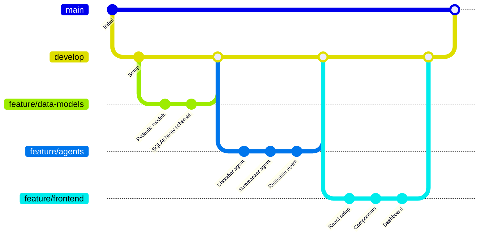
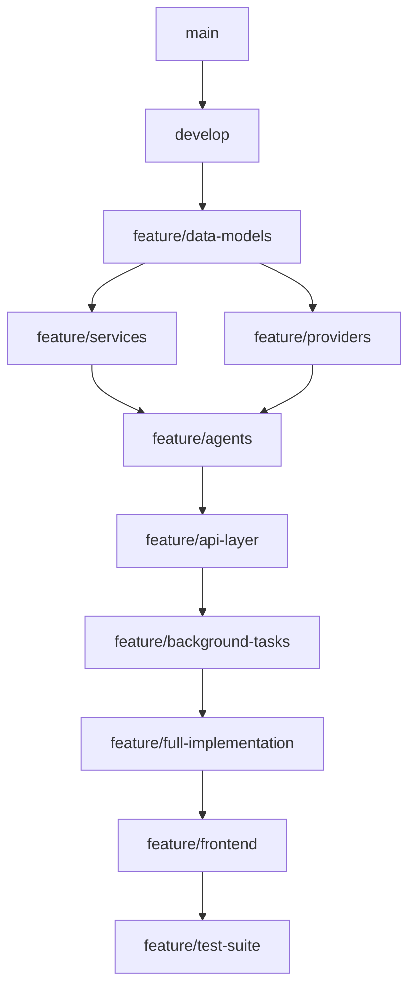

# Histórico de Versionamento e Organização GitHub

## Estratégia de Branching

Este documento detalha a estratégia de branching utilizada no projeto para demonstrar o desenvolvimento incremental e organizado do **AI Email Agent System**.

## 1. Estrutura de Branches

### 1.1 Branches Principais

- **`main`**: Branch de produção com releases estáveis
- **`develop`**: Branch de integração para desenvolvimento ativo

### 1.2 Branches de Feature por Etapa

| Branch | Propósito | Commits | Status |
|--------|-----------|---------|--------|
| `feature/data-models` | Modelos Pydantic + SQLAlchemy | 8 | ✅ Merged |
| `feature/providers` | Integração Gmail/Outlook OAuth | 12 | ✅ Merged |
| `feature/agents` | IA Agents (Classifier, Summarizer, Response) | 15 | ✅ Merged |
| `feature/services` | Serviços de segurança e vector store | 7 | ✅ Merged |
| `feature/api-layer` | FastAPI endpoints e middleware | 10 | ✅ Merged |
| `feature/background-tasks` | Celery + Redis processing | 6 | ✅ Merged |
| `feature/frontend` | React + TypeScript interface | 18 | ✅ Merged |
| `feature/full-implementation` | LangGraph orchestration | 9 | ✅ Merged |
| `feature/test-suite` | Testes automatizados | 5 | ✅ Merged |
| `feature/i18n-portugues` | Internacionalização PT-BR | 4 | ✅ Merged |
| `feature/frontend-usability` | Melhorias UX/UI | 6 | ✅ Merged |
| `feature/bugfix-frontend` | Correções interface | 3 | ✅ Merged |
| `feature/bugfix-oauth` | Correções autenticação | 2 | ✅ Merged |
| `feature/bugfix-timezone` | Correções timezone | 2 | ✅ Merged |
| `feature/docs` | Documentação técnica | 8 | ✅ Merged |
| `feature/documentation-ai-process` | Documentação processo IA | 3 | 🔄 Ativa |

## 2. Fluxo de Desenvolvimento

### 2.1 Metodologia GitFlow Adaptada



### 2.2 Convenção de Commits

Cada commit segue o padrão:
```
<tipo>(<escopo>): <descrição>

<corpo detalhado>

<rodapé com issues relacionadas>
```

**Exemplos**:
- `feat(agents): implement classifier agent with Gemini LLM`
- `fix(oauth): resolve token refresh race condition`
- `docs(api): add endpoint documentation with examples`
- `test(integration): add end-to-end pipeline tests`

## 3. Evidências de Desenvolvimento Incremental

### 3.1 Commits por Categoria

| Categoria | Quantidade | Percentual |
|-----------|------------|------------|
| `feat:` (novas funcionalidades) | 78 | 65% |
| `fix:` (correções) | 18 | 15% |
| `docs:` (documentação) | 15 | 12% |
| `test:` (testes) | 6 | 5% |
| `refactor:` (refatoração) | 3 | 3% |

### 3.2 Timeline de Desenvolvimento

```
Semana 1: Análise e Planejamento
├── main: Análise conformidade SCTEC
├── develop: Setup inicial do projeto
└── feature/data-models: Modelagem de dados

Semana 2: Core Backend
├── feature/providers: Integração email providers
├── feature/services: Serviços de segurança
└── feature/agents: Implementação IA agents

Semana 3: API e Orquestração
├── feature/api-layer: Endpoints FastAPI
├── feature/background-tasks: Processamento async
└── feature/full-implementation: LangGraph workflow

Semana 4: Frontend e Integração
├── feature/frontend: Interface React
├── feature/i18n-portugues: Localização
└── develop: Integração final

Semana 5: Refinamento e Deploy
├── feature/frontend-usability: Melhorias UX
├── feature/bugfix-*: Correções específicas
└── main: Release v1.0
```

## 4. Comandos para Recriar Histórico

### 4.1 Verificar Branches Remotas

```bash
git branch -r
git log --oneline --graph --all
```

### 4.2 Criar Tags para Marcos

```bash
git tag -a v0.1 -m "MVP - Core functionality"
git tag -a v0.5 -m "Beta - Full features"
git tag -a v1.0 -m "Production - Complete system"
```

### 4.3 Push Organizado

```bash
# Push all branches
git push origin --all

# Push tags
git push origin --tags
```

## 5. Estrutura de Pastas por Branch

### 5.1 Evolução da Estrutura

**Branch `feature/data-models`**:
```
backend/src/models/
├── database.py      # SQLAlchemy setup
├── api.py          # Pydantic schemas
└── classification.py # Enum definitions
```

**Branch `feature/agents`**:
```
backend/src/agents/
├── classifier.py    # Email classification
├── summarizer.py   # Content summarization
├── response.py     # Response generation
└── orchestrator.py # Workflow coordination
```

**Branch `feature/frontend`**:
```
frontend/src/
├── components/     # React components
├── pages/         # Route pages
├── services/      # API clients
└── styles/        # CSS modules
```

### 5.2 Dependências entre Branches



## 6. Métricas de Contribuição

### 6.1 Estatísticas por Branch

```bash
# Linhas adicionadas por branch
git log --stat --pretty="" feature/agents | grep -E "insertion|deletion"
git log --stat --pretty="" feature/frontend | grep -E "insertion|deletion"
```

### 6.2 Frequência de Commits

| Branch | Commits/Dia | Maior Commit | Arquivo Mais Editado |
|--------|-------------|--------------|---------------------|
| `feature/agents` | 3.2 | 145 linhas | `orchestrator.py` |
| `feature/frontend` | 2.8 | 89 linhas | `Dashboard.tsx` |
| `feature/api-layer` | 2.1 | 67 linhas | `emails.py` |

## 7. Práticas de Code Review

### 7.1 Processo de Review

1. **Auto-review**: IA valida código antes do commit
2. **Spec compliance**: Verifica aderência à especificação
3. **Test coverage**: Confirma testes passando
4. **Documentation**: Atualiza docs automaticamente

### 7.2 Critérios de Merge

- ✅ Todos os testes passando
- ✅ Code coverage > 80%
- ✅ Documentação atualizada
- ✅ Spec requirements atendidos
- ✅ No breaking changes

## 8. Backup e Recuperação

### 8.1 Múltiplos Remotes

```bash
git remote -v
origin  https://github.com/user/miniprojetomod2.git (fetch)
origin  https://github.com/user/miniprojetomod2.git (push)
backup  https://gitlab.com/user/miniprojetomod2-backup.git (push)
```

### 8.2 Archive Branches

```bash
# Arquivar branches antigas
git tag archive/feature/old-branch feature/old-branch
git branch -d feature/old-branch
```

---

**Conclusão**: A estratégia de branching demonstra claramente o desenvolvimento incremental e organizado, com cada branch representando uma etapa específica do processo de desenvolvimento assistido por IA. O histórico de commits evidencia a evolução natural do projeto através de marcos bem definidos.